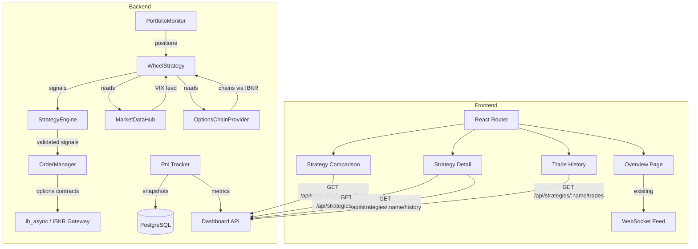
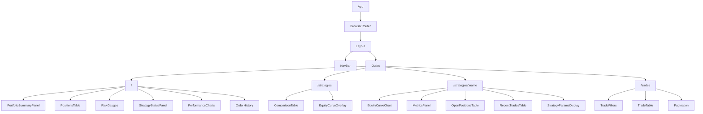

# Design Document: ThetaGang Dashboard Upgrade

## Overview

This design adds a WheelStrategy implementation to the IBKR Trading Bot and upgrades the dashboard to support per-strategy P&L tracking with multi-page navigation. The Wheel strategy sells cash-secured puts, writes covered calls on assigned shares, rolls expiring positions, and adapts to VIX regime changes. The dashboard gains a strategy comparison page, per-strategy detail pages, and a filterable trade history page.

The implementation extends existing patterns: WheelStrategy subclasses `BaseStrategy`, options orders flow through the existing `OrderManager` with a new contract builder, P&L tracking extends `PortfolioMonitor`, and the React frontend adds `react-router-dom` for client-side routing.

## Architecture



**Key architectural decisions:**

1. Options chain data is fetched via a new `OptionsChainProvider` that wraps `ib_async.reqSecDefOptParams` and `ib_async.reqTickers` for greeks. This keeps MarketDataHub focused on bar-building while options-specific logic lives in a dedicated module.

2. The P&L tracker is a new class (`PnLTracker`) that composes with `PortfolioMonitor` rather than subclassing it. It subscribes to trade events and writes to the database on a schedule.

3. The frontend adds `react-router-dom` as the only new runtime dependency. All new pages reuse the existing `useApi` pattern with `@tanstack/react-query`.

## Components and Interfaces

### 1. WheelStrategy (`src/strategies/wheel.py`)

```python
class WheelStrategy(BaseStrategy):
    """Options Wheel strategy: sell puts, write calls on assignment, roll expiring."""

    # Default parameters (overridden by config.yaml)
    DEFAULT_TARGET_DELTA = 0.30
    DEFAULT_MIN_DTE = 30
    DEFAULT_MAX_DTE = 45
    DEFAULT_ROLL_DTE_THRESHOLD = 7
    DEFAULT_VIX_HIGH_THRESHOLD = 30.0
    DEFAULT_VIX_REENTRY_THRESHOLD = 25.0
    DEFAULT_MAX_POSITIONS_PER_SYMBOL = 1

    def __init__(
        self,
        config: StrategyConfig,
        data_hub: MarketDataHub,
        options_chain: OptionsChainProvider,
        portfolio_monitor: PortfolioMonitor,
    ) -> None: ...

    async def evaluate(self) -> list[Signal]: ...
    def required_indicators(self) -> list[str]: ...
    def validate_capital(self, allocated: Decimal) -> bool: ...
    def update_parameters(self, parameters: dict) -> None: ...

    # Internal methods
    async def _get_vix_level(self) -> float | None: ...
    async def _generate_put_signals(self) -> list[Signal]: ...
    async def _generate_call_signals(self) -> list[Signal]: ...
    async def _generate_roll_signals(self) -> list[Signal]: ...
    def _select_strike_by_delta(
        self, chain: list[OptionContract], target_delta: float
    ) -> OptionContract | None: ...
    def _is_within_dte_range(self, expiration: date) -> bool: ...
    def _has_existing_short_position(self, symbol: str, right: str) -> bool: ...
    def _get_assigned_shares(self) -> dict[str, int]: ...
    def _calculate_cash_required(self, strike: Decimal, quantity: int) -> Decimal: ...
```

The `evaluate()` method orchestrates the full cycle:
1. Fetch current VIX level; suppress new puts if above threshold.
2. Check for assigned shares needing covered calls.
3. Check for positions within the rolling window.
4. Generate new put signals for symbols without existing short puts.

Each signal carries `OptionSignalParams` metadata so the order submission layer can build the correct `ib_async.Option` contract.

### 2. OptionsChainProvider (`src/data/options_chain.py`)

```python
@dataclass
class OptionContract:
    symbol: str
    underlying: str
    strike: Decimal
    expiration: date
    right: str  # "P" or "C"
    delta: float
    gamma: float
    theta: float
    vega: float
    implied_vol: float
    bid: Decimal
    ask: Decimal
    mid: Decimal

class OptionsChainProvider:
    """Fetches and caches option chains from IBKR."""

    def __init__(self, connection: ConnectionProtocol, cache_ttl: int = 300) -> None: ...

    async def get_chain(
        self, underlying: str, right: str = "P", min_dte: int = 30, max_dte: int = 45
    ) -> list[OptionContract]: ...

    async def get_vix(self) -> float | None: ...

    def invalidate_cache(self, underlying: str) -> None: ...
```

Uses `ib_async.reqSecDefOptParams` to discover available expirations/strikes, then `ib_async.reqTickers` on filtered contracts to get live greeks. Results are cached with a configurable TTL (default 5 minutes).

### 3. Options Signal Extension (`src/strategies/signals.py`)

The existing `Signal` dataclass gains an optional `option_params` field:

```python
@dataclass
class OptionSignalParams:
    """Parameters specific to options signals."""
    underlying: str
    strike: Decimal
    expiration: date
    right: str  # "P" or "C"
    action: str  # "SELL_TO_OPEN", "BUY_TO_CLOSE"

@dataclass
class Signal:
    # ... existing fields unchanged ...
    option_params: OptionSignalParams | None = None
```

### 4. OrderManager Options Support

The `OrderManager.submit_order` method already accepts a generic `contract: Any`. For options, a new utility builds the contract:

```python
# src/orders/options_contract.py
def build_option_contract(params: OptionSignalParams) -> Any:
    """Build an ib_async Option contract from signal params."""
    from ib_async import Option
    return Option(
        symbol=params.underlying,
        lastTradeDateOrExpiry=params.expiration.strftime("%Y%m%d"),
        strike=float(params.strike),
        right=params.right,
        exchange="SMART",
    )
```

The action mapping in `OrderManager._place_order`:
- Signal with `direction=SHORT` + `option_params.action="SELL_TO_OPEN"` → IBKR action="SELL"
- Signal with `direction=LONG` + `option_params.action="BUY_TO_CLOSE"` → IBKR action="BUY"

No structural changes to `OrderManager` are needed. The `StrategyEngine` calls `build_option_contract` when `signal.option_params` is present, then passes the result to `submit_order`.

### 5. PnLTracker (`src/portfolio/pnl_tracker.py`)

```python
@dataclass
class StrategyPnL:
    strategy_name: str
    realized_pnl: Decimal
    unrealized_pnl: Decimal
    total_pnl: Decimal

@dataclass
class EquityPoint:
    date: date
    equity: Decimal

@dataclass
class TradeDetail:
    id: int
    strategy_name: str
    symbol: str
    direction: str
    entry_price: Decimal
    exit_price: Decimal | None
    quantity: Decimal
    realized_pnl: Decimal
    opened_at: datetime
    closed_at: datetime | None

class PnLTracker:
    """Tracks per-strategy P&L and records daily snapshots."""

    def __init__(
        self,
        portfolio_monitor: PortfolioMonitor,
        db_session_factory: Any,
        update_interval: int = 60,
    ) -> None: ...

    async def start(self) -> None:
        """Start the periodic unrealized P&L update loop."""

    async def stop(self) -> None:
        """Stop the update loop."""

    async def get_strategy_pnl(self, strategy_name: str) -> StrategyPnL:
        """Compute realized + unrealized P&L for one strategy."""

    async def get_all_strategies_pnl(self) -> list[StrategyPnL]:
        """Compute P&L for all strategies."""

    async def record_daily_snapshot(self) -> None:
        """Write end-of-day per-strategy equity to strategy_snapshots table."""

    async def get_equity_history(
        self, strategy_name: str, start: date | None = None, end: date | None = None
    ) -> list[EquityPoint]:
        """Query strategy_snapshots for equity curve data."""

    async def get_trades(
        self, strategy_name: str | None = None,
        symbol: str | None = None,
        start: date | None = None,
        end: date | None = None,
        limit: int = 25,
        offset: int = 0,
    ) -> tuple[list[TradeDetail], int]:
        """Query trades with filters. Returns (items, total_count)."""

    async def record_trade_close(
        self, strategy_name: str, symbol: str, direction: str,
        entry_price: Decimal, exit_price: Decimal, quantity: Decimal,
        realized_pnl: Decimal, entry_time: datetime, exit_time: datetime,
    ) -> None:
        """Record a closed trade to the database."""
```

The `start()` method launches an asyncio task that updates unrealized P&L every `update_interval` seconds by marking open positions to market via `PortfolioMonitor`.

### 6. New API Endpoints (`src/dashboard/api.py` additions)

| Method | Path | Description |
|--------|------|-------------|
| GET | `/api/strategies/{name}/pnl` | Realized, unrealized, total P&L for one strategy |
| GET | `/api/strategies/comparison` | All strategies with metrics + P&L side-by-side |
| GET | `/api/strategies/{name}/history?start=&end=` | Equity curve time-series |
| GET | `/api/strategies/{name}/trades?limit=&offset=` | Paginated trade list for one strategy |
| GET | `/api/trades?strategy=&symbol=&start=&end=&limit=&offset=` | All trades with filters |

Response models:

```python
class StrategyPnLResponse(BaseModel):
    strategy_name: str
    realized_pnl: float
    unrealized_pnl: float
    total_pnl: float

class StrategyComparisonResponse(BaseModel):
    strategies: list[StrategyComparisonItem]

class StrategyComparisonItem(BaseModel):
    name: str
    total_return: float
    sharpe_ratio: float
    sortino_ratio: float
    max_drawdown: float
    win_rate: float
    profit_factor: float
    total_trades: int
    realized_pnl: float
    unrealized_pnl: float

class EquityPointResponse(BaseModel):
    date: str
    equity: float

class TradeDetailResponse(BaseModel):
    id: int
    strategy_name: str
    symbol: str
    direction: str
    entry_price: float
    exit_price: float | None
    quantity: float
    realized_pnl: float
    opened_at: str
    closed_at: str | None

class PaginatedTradesResponse(BaseModel):
    items: list[TradeDetailResponse]
    total: int
    limit: int
    offset: int
```

### 7. Frontend Pages and Components



New files:
- `dashboard-ui/src/pages/OverviewPage.tsx` — extracts current App content
- `dashboard-ui/src/pages/StrategyComparisonPage.tsx`
- `dashboard-ui/src/pages/StrategyDetailPage.tsx`
- `dashboard-ui/src/pages/TradeHistoryPage.tsx`
- `dashboard-ui/src/components/NavBar.tsx`
- `dashboard-ui/src/components/Layout.tsx`
- `dashboard-ui/src/components/ComparisonTable.tsx`
- `dashboard-ui/src/components/EquityCurveOverlay.tsx`
- `dashboard-ui/src/components/EquityCurveChart.tsx`
- `dashboard-ui/src/components/MetricsPanel.tsx`
- `dashboard-ui/src/components/TradeFilters.tsx`
- `dashboard-ui/src/components/TradeTable.tsx`
- `dashboard-ui/src/components/Pagination.tsx`
- `dashboard-ui/src/components/StrategyParamsDisplay.tsx`

## Data Models

### New Database Tables

#### `options_trades` — Closed options trade records

```sql
CREATE TABLE options_trades (
    id SERIAL PRIMARY KEY,
    strategy_name VARCHAR(50) NOT NULL,
    underlying VARCHAR(20) NOT NULL,
    contract_symbol VARCHAR(40) NOT NULL,
    right CHAR(1) NOT NULL,
    strike NUMERIC NOT NULL,
    expiration DATE NOT NULL,
    action VARCHAR(15) NOT NULL,
    quantity NUMERIC NOT NULL,
    entry_price NUMERIC NOT NULL,
    exit_price NUMERIC,
    premium_collected NUMERIC NOT NULL,
    realized_pnl NUMERIC,
    commission NUMERIC NOT NULL DEFAULT 0,
    opened_at TIMESTAMPTZ NOT NULL,
    closed_at TIMESTAMPTZ,
    status VARCHAR(15) NOT NULL DEFAULT 'open'
);
CREATE INDEX idx_options_trades_strategy ON options_trades(strategy_name);
CREATE INDEX idx_options_trades_underlying ON options_trades(underlying);
CREATE INDEX idx_options_trades_status ON options_trades(status);
```

#### `strategy_snapshots` — Per-strategy daily equity snapshots

```sql
CREATE TABLE strategy_snapshots (
    id SERIAL PRIMARY KEY,
    strategy_name VARCHAR(50) NOT NULL,
    date DATE NOT NULL,
    equity NUMERIC NOT NULL,
    realized_pnl NUMERIC NOT NULL,
    unrealized_pnl NUMERIC NOT NULL,
    total_pnl NUMERIC NOT NULL,
    trade_count INTEGER NOT NULL DEFAULT 0,
    UNIQUE(strategy_name, date)
);
CREATE INDEX idx_strategy_snapshots_name_date ON strategy_snapshots(strategy_name, date);
```

### SQLAlchemy Models (`src/persistence/models.py` additions)

```python
class OptionsTradeRecord(Base):
    __tablename__ = "options_trades"

    id: Mapped[int] = mapped_column(Integer, primary_key=True, autoincrement=True)
    strategy_name: Mapped[str] = mapped_column(String(50), nullable=False, index=True)
    underlying: Mapped[str] = mapped_column(String(20), nullable=False, index=True)
    contract_symbol: Mapped[str] = mapped_column(String(40), nullable=False)
    right: Mapped[str] = mapped_column(String(1), nullable=False)
    strike: Mapped[Decimal] = mapped_column(Numeric, nullable=False)
    expiration: Mapped[date] = mapped_column(Date, nullable=False)
    action: Mapped[str] = mapped_column(String(15), nullable=False)
    quantity: Mapped[Decimal] = mapped_column(Numeric, nullable=False)
    entry_price: Mapped[Decimal] = mapped_column(Numeric, nullable=False)
    exit_price: Mapped[Decimal | None] = mapped_column(Numeric, nullable=True)
    premium_collected: Mapped[Decimal] = mapped_column(Numeric, nullable=False)
    realized_pnl: Mapped[Decimal | None] = mapped_column(Numeric, nullable=True)
    commission: Mapped[Decimal] = mapped_column(Numeric, nullable=False, default=0)
    opened_at: Mapped[datetime] = mapped_column(DateTime(timezone=True), nullable=False)
    closed_at: Mapped[datetime | None] = mapped_column(DateTime(timezone=True), nullable=True)
    status: Mapped[str] = mapped_column(String(15), nullable=False, default="open", index=True)


class StrategySnapshotRecord(Base):
    __tablename__ = "strategy_snapshots"
    __table_args__ = (UniqueConstraint("strategy_name", "date"),)

    id: Mapped[int] = mapped_column(Integer, primary_key=True, autoincrement=True)
    strategy_name: Mapped[str] = mapped_column(String(50), nullable=False, index=True)
    date: Mapped[date] = mapped_column(Date, nullable=False, index=True)
    equity: Mapped[Decimal] = mapped_column(Numeric, nullable=False)
    realized_pnl: Mapped[Decimal] = mapped_column(Numeric, nullable=False)
    unrealized_pnl: Mapped[Decimal] = mapped_column(Numeric, nullable=False)
    total_pnl: Mapped[Decimal] = mapped_column(Numeric, nullable=False)
    trade_count: Mapped[int] = mapped_column(Integer, nullable=False, default=0)
```

### TypeScript Interfaces (Frontend additions to `types.ts`)

```typescript
export interface StrategyPnL {
  strategy_name: string;
  realized_pnl: number;
  unrealized_pnl: number;
  total_pnl: number;
}

export interface StrategyComparison {
  name: string;
  total_return: number;
  sharpe_ratio: number;
  sortino_ratio: number;
  max_drawdown: number;
  win_rate: number;
  profit_factor: number;
  total_trades: number;
  realized_pnl: number;
  unrealized_pnl: number;
}

export interface EquityPoint {
  date: string;
  equity: number;
}

export interface TradeDetail {
  id: number;
  strategy_name: string;
  symbol: string;
  direction: string;
  entry_price: number;
  exit_price: number | null;
  quantity: number;
  realized_pnl: number;
  opened_at: string;
  closed_at: string | null;
}

export interface PaginatedResponse<T> {
  items: T[];
  total: number;
  limit: number;
  offset: number;
}
```


## Correctness Properties

*A property is a characteristic or behavior that should hold true across all valid executions of a system — essentially, a formal statement about what the system should do. Properties serve as the bridge between human-readable specifications and machine-verifiable correctness guarantees.*

### Property 1: Put signal generation requires preconditions

*For any* symbol in the strategy's symbol list, a SELL PUT signal is generated if and only if: (a) no existing short put position exists for that symbol, (b) available buying power exceeds the cash required to secure the put at the selected strike, and (c) VIX is not in suppression mode.

**Validates: Requirements 1.1, 1.5, 4.1**

### Property 2: Call signal generation requires assignment and lot completeness

*For any* symbol where the strategy holds shares, a SELL CALL signal is generated if and only if: (a) shares held >= 100, (b) no existing short call position exists for that symbol. The number of contracts in the signal equals floor(shares_held / 100).

**Validates: Requirements 2.1, 2.4, 2.5**

### Property 3: Option strike selection minimizes delta distance

*For any* option chain and target delta value, the selected strike has the minimum absolute difference between its delta and the target delta among all available strikes within the valid DTE range.

**Validates: Requirements 1.2, 2.2**

### Property 4: Expiration selection stays within DTE range

*For any* option chain and configured min_dte/max_dte range, the selected expiration date has a DTE value that satisfies min_dte <= DTE <= max_dte. If no expiration exists within the range, no signal is generated.

**Validates: Requirements 1.3, 1.4, 2.3**

### Property 5: Roll signals require net credit

*For any* short option position within the rolling window (DTE < roll_dte_threshold) that is profitable, a roll signal is generated only if the new position can be opened for a net credit (premium received from new position > cost to close current position). If rolling would result in a net debit, no roll signal is generated.

**Validates: Requirements 3.1, 3.2, 3.3**

### Property 6: VIX regime detection with hysteresis

*For any* sequence of VIX values, put-selling signals are suppressed when VIX exceeds vix_high_threshold and remain suppressed until VIX drops below vix_reentry_threshold (not just below vix_high_threshold). Rolling and call-writing signals are never suppressed by VIX level.

**Validates: Requirements 4.1, 4.2, 4.3**

### Property 7: Signal notional bounded by capital allocation

*For any* set of signals generated in a single evaluate() cycle, the total notional exposure (sum of strike * 100 * contracts for puts, or current price * shares for calls) does not exceed the capital allocated to the wheel strategy.

**Validates: Requirements 5.1**

### Property 8: Parameter hot-reload round trip

*For any* valid parameter dictionary passed to update_parameters(), the strategy's internal parameter values match the dictionary values after the call. Parameters not present in the dictionary retain their previous values.

**Validates: Requirements 6.3, 6.4**

### Property 9: Realized P&L equals sum of closed trade profits

*For any* set of closed trades attributed to a strategy, the realized P&L reported by PnLTracker equals the sum of individual trade realized P&L values (exit_price - entry_price) * quantity - commissions for that strategy.

**Validates: Requirements 7.1**

### Property 10: Unrealized P&L equals mark-to-market of open positions

*For any* set of open positions attributed to a strategy with known current market prices, the unrealized P&L reported by PnLTracker equals the sum of (current_price - entry_price) * quantity for each position in that strategy.

**Validates: Requirements 7.2**

### Property 11: History endpoint respects date range filter

*For any* equity history query with start and end date parameters, all returned equity points have dates satisfying start <= point.date <= end. If no start/end is provided, all available history is returned.

**Validates: Requirements 8.2**

### Property 12: Pagination returns correct slice

*For any* collection of N records, a query with limit L and offset O returns exactly min(L, N - O) records starting from position O in the ordered collection. The records are a contiguous subsequence of the full ordered set.

**Validates: Requirements 8.3, 12.5**

### Property 13: Closed trade records contain all required fields

*For any* trade that is closed and recorded by PnLTracker, the persisted record contains non-null values for: strategy_name, symbol, entry_price, exit_price, quantity, realized_pnl, entry_timestamp, and exit_timestamp.

**Validates: Requirements 8.4**

### Property 14: Trade history is ordered by date descending

*For any* set of trades returned by the trade history endpoint, for all consecutive pairs (trade[i], trade[i+1]), trade[i].date >= trade[i+1].date.

**Validates: Requirements 12.1**

### Property 15: Trade filters produce matching results

*For any* set of filter criteria (strategy_name, symbol, date_range) applied to a trade collection, every trade in the filtered result matches all active filter predicates. No trade matching all predicates is excluded from the result.

**Validates: Requirements 12.3**

### Property 16: Return-based color coding

*For any* strategy with a total_return value, the rendered row applies a green indicator class when total_return > 0 and a red indicator class when total_return < 0.

**Validates: Requirements 10.3**

## Error Handling

### WheelStrategy Errors

| Error Condition | Handling | Recovery |
|----------------|----------|----------|
| VIX data unavailable | Log warning, use last known value. If never received, suppress puts. | Automatic on next successful VIX fetch |
| Option chain empty or unavailable | Log warning, skip symbol for this cycle | Retry next evaluation cycle |
| No contracts within DTE range | Log info with symbol and available expirations, skip | Retry next cycle |
| Insufficient buying power | Log info with required vs available, skip symbol | Retry when capital frees up |
| Roll would be net debit | Log decision with amounts, allow position to proceed to expiry | No retry — intentional skip |
| RiskManager rejects signal | Log rejection reason, skip trade | Retry next cycle if conditions change |
| StrategyEngine halts (5 consecutive failures) | Strategy enters HALTED state | Manual restart required |

### PnLTracker Errors

| Error Condition | Handling | Recovery |
|----------------|----------|----------|
| Database connection failure | Raise HTTPException 503 from API | Automatic reconnect via pool |
| Strategy not found | Return empty P&L (zeros) | N/A |
| Snapshot already exists for date | Upsert (update existing record) | N/A |
| Trade missing required fields | Log error, skip trade in aggregation | Manual data fix |

### Frontend Errors

| Error Condition | Handling | Recovery |
|----------------|----------|----------|
| API request fails | Show error toast, retain stale data | Auto-retry with react-query |
| WebSocket disconnects | Show "Disconnected" badge, auto-reconnect | Existing reconnect logic (3s interval) |
| Invalid route | Redirect to Overview (/) | N/A |
| Empty data (no trades/strategies) | Show empty state with helpful message | N/A |

## Testing Strategy

### Property-Based Tests (Hypothesis)

The project already uses Hypothesis (`.hypothesis/` directory exists). Each correctness property maps to a property-based test with minimum 100 iterations.

**Library:** `hypothesis` (already installed)

**Test files:**
- `tests/unit/test_wheel_strategy_properties.py` — Properties 1-8 (strategy logic)
- `tests/unit/test_pnl_tracker_properties.py` — Properties 9-13 (P&L computation)
- `tests/unit/test_dashboard_properties.py` — Properties 14-16 (API/rendering logic)

**Configuration:** Each test runs with `@settings(max_examples=100)` minimum.

**Tag format:** Each test includes a docstring comment:
```python
# Feature: thetagang-dashboard-upgrade, Property 1: Put signal generation requires preconditions
```

### Unit Tests (pytest)

Focus on specific examples and edge cases not covered by property tests:

- **WheelStrategy:** VIX unavailable fallback, config loading from YAML, logging verification, BaseStrategy interface compliance
- **Options contract builder:** Correct contract construction for known inputs
- **PnLTracker:** API endpoint response schemas, empty strategy handling
- **Frontend (vitest):** Component rendering, navigation, filter controls presence

### Integration Tests

- **StrategyEngine + WheelStrategy:** Registration, evaluation cycle, signal routing
- **API endpoints:** Full request/response cycle with test database
- **PnLTracker + Database:** Snapshot recording, trade querying with real SQLAlchemy session
- **RiskManager integration:** Signal validation pipeline

### Test Pyramid

```
Property Tests (100+ iterations each)  <- Correctness guarantees
         |
    Unit Tests (specific examples)     <- Edge cases, error paths
         |
   Integration Tests (2-3 per flow)    <- Wiring verification
```

